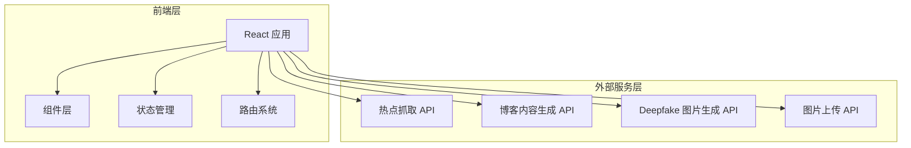

# 博客智能体 - 技术架构文档

## 1. 架构设计



## 2. 技术描述
- **前端**: React@18 + TypeScript + Tailwind CSS@3 + Vite
- **初始化工具**: vite-init
- **后端**: 无后端，前端直接对接外部 API
- **状态管理**: Zustand
- **富文本编辑器**: Quill 或类似轻量级富文本编辑器
- **图片处理**: 原生 File API + Canvas（裁剪旋转）

## 3. 路由定义

| 路由 | 用途 |
|-----|------|
| / | 首页（热点选择、博客生成、预览导出） |

## 4. 类型定义与接口规范

### 4.1 数据类型定义

```typescript
// 热点数据类型
interface HotTopic {
  id: string;
  title: string;
  content: string;
  hotValue: number;
  type: string;
  time: string;
  selected?: boolean;
}

// 博客内容类型
interface BlogContent {
  title: string;
  subtitle: string;
  introduction: string;
  sections: BlogSection[];
  conclusion: string;
}

interface BlogSection {
  heading: string;
  content: string;
  image?: string;
}

// 生成参数类型
interface GenerationParams {
  style: 'professional' | 'casual' | 'educational' | 'emotional';
  wordCount: 'short' | 'standard' | 'long';
  depth: 'basic' | 'deep';
}

// 图片生成参数
interface ImageGenerationParams {
  keywords: string;
  style: 'realistic' | 'illustration' | 'minimal' | 'tech';
  size: '1920x1080' | '1080x1080' | '720x480';
  count: number;
}
```

### 4.2 API 接口规范

#### 热点抓取接口
```typescript
// GET /api/hot-topics
// 无参数
// 返回类型: HotTopic[]
```

#### 博客内容生成接口
```typescript
// POST /api/generate-blog
interface RequestBody {
  topics: HotTopic[];
  params: GenerationParams;
}
// 返回类型: BlogContent
```

#### Deepfake 图片生成接口
```typescript
// POST /api/generate-images
interface RequestBody {
  params: ImageGenerationParams;
}
// 返回类型: string[] (图片 URL 数组)
```

#### 图片上传接口
```typescript
// POST /api/upload-image
// FormData: { file: File }
// 返回类型: { url: string }
```

## 5. 组件架构

```
src/
├── components/
│   ├── Header.tsx          # 顶部导航栏
│   ├── HotTopicPanel.tsx   # 左侧热点选择面板
│   ├── HotTopicCard.tsx    # 热点卡片
│   ├── ContentEditor.tsx   # 内容编辑区
│   ├── ImageManager.tsx    # 图片管理
│   ├── BlogPreview.tsx     # 博客预览
│   └── ActionBar.tsx       # 底部操作栏
├── pages/
│   └── Home.tsx            # 首页
├── hooks/
│   └── useBlogStore.ts     # Zustand 状态管理
├── utils/
│   ├── api.ts              # API 调用封装
│   └── helpers.ts          # 工具函数
├── App.tsx
└── main.tsx
```

## 6. 状态管理

使用 Zustand 管理应用状态：

```typescript
interface BlogStore {
  hotTopics: HotTopic[];
  selectedTopics: HotTopic[];
  blogContent: BlogContent | null;
  images: string[];
  params: GenerationParams;
  isGenerating: boolean;
  
  // 动作
  setHotTopics: (topics: HotTopic[]) => void;
  toggleTopic: (id: string) => void;
  selectAllTopics: () => void;
  clearSelection: () => void;
  setBlogContent: (content: BlogContent) => void;
  setParams: (params: Partial<GenerationParams>) => void;
  addImage: (imageUrl: string) => void;
  removeImage: (index: number) => void;
  setGenerating: (val: boolean) => void;
  reset: () => void;
}
```

## 7. 响应式设计要点

- 使用 Tailwind 的响应式断点: sm, md, lg, xl
- 移动端采用垂直堆叠布局
- 图片自适应容器宽度
- 触摸友好的按钮尺寸（≥48px）
