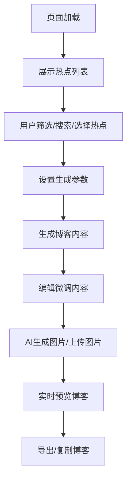

# 博客智能体 Web 前端 - 产品需求文档

## 1. 产品概述
博客智能体是一款自动化图文博客生成工具，帮助用户通过热点内容选择、AI图片生成/上传，一键生成排版规整的原创博客内容。
- 解决用户创作博客耗时耗力的问题，提供热点驱动+AI图文生成的完整解决方案
- 目标用户：内容创作者、自媒体工作者、需要快速生成博客的个人/企业

## 2. 核心功能

### 2.1 用户角色
无复杂用户角色体系，采用开放式访问设计。

### 2.2 功能模块
1. **首页（热点选择与博客生成主界面）**：热点信息展示、内容生成、图片管理、预览导出
2. **博客预览与导出**：实时预览、格式导出、内容复制

### 2.3 页面详情

| 页面名称 | 模块名称 | 功能描述 |
|---------|---------|---------|
| 首页 | 热点信息抓取与选择面板 | 卡片式瀑布流展示热点、分类筛选、搜索、刷新、多选功能 |
| 首页 | 博客内容自动生成模块 | 风格选择、字数控制、富文本编辑、AI内容生成 |
| 首页 | 图片生成与上传模块 | Deepfake AI图片生成、本地图片上传、图片编辑与混排 |
| 首页 | 完整博客预览与导出模块 | 实时预览、HTML/Markdown/文本导出、一键复制 |

## 3. 核心流程
用户进入页面 → 选择热点内容 → 设置生成参数 → 一键生成博客内容 → 编辑微调 → 添加/生成图片 → 预览效果 → 导出/复制完成。

## 4. 用户界面设计

### 4.1 设计风格
- **主色调**：深蓝科技感 (#2563eb) 搭配现代灰色 (#f8fafc, #1e293b)
- **按钮风格**：圆角矩形，渐变色，带hover动效
- **字体**：使用 Geist Sans 现代简洁字体
- **布局风格**：左右分栏布局，左侧热点面板 (40%)，右侧编辑预览区 (60%)
- **图标风格**：简约线性图标，来自 Lucide React

### 4.2 页面设计概述

| 页面名称 | 模块名称 | UI 元素 |
|---------|---------|---------|
| 首页 | 顶部导航栏 | Logo、功能入口、帮助提示、刷新按钮 |
| 首页 | 左侧热点面板 | 搜索框、分类筛选、热点卡片瀑布流、选中预览 |
| 首页 | 右侧内容区 | 参数设置面板、富文本编辑器、图片管理区、预览区 |
| 首页 | 底部操作栏 | 生成内容、生成图片、导出、重置等操作按钮 |

### 4.3 响应性
桌面端优先，移动端自适应布局，支持触摸操作。

### 4.4 视觉效果
- 页面加载时的渐入动画
- 卡片悬浮动效
- 按钮点击反馈
- 平滑的状态切换过渡
